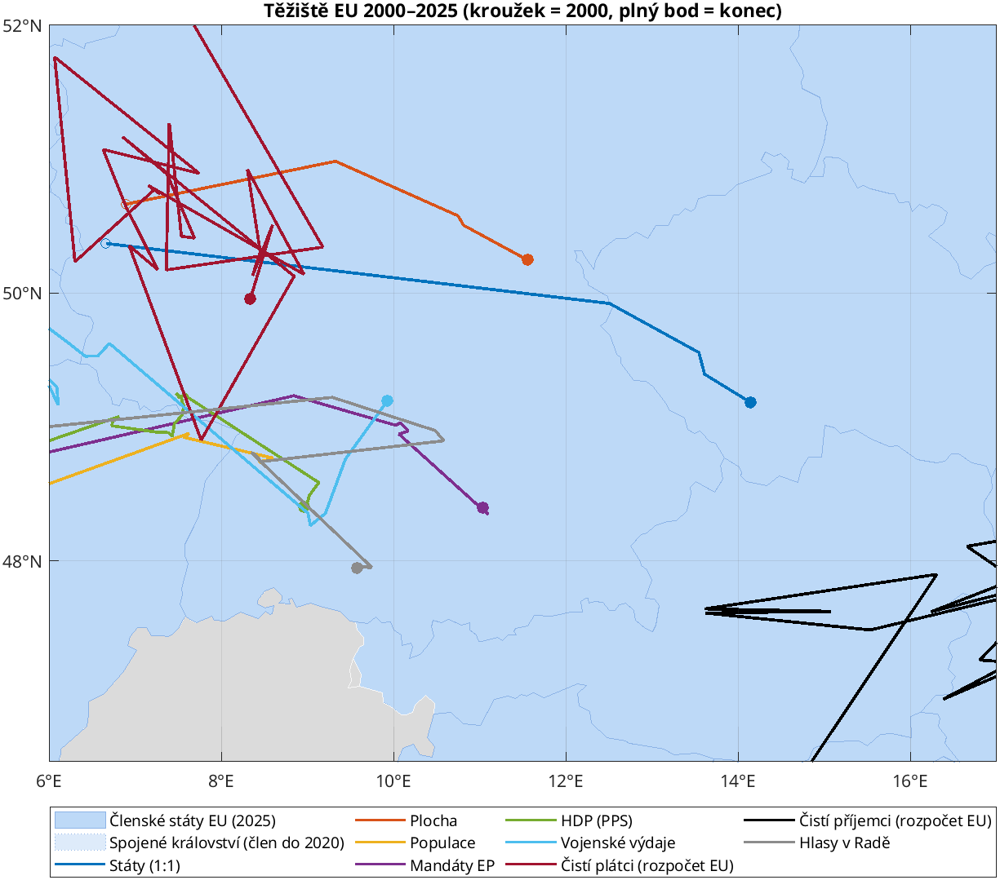
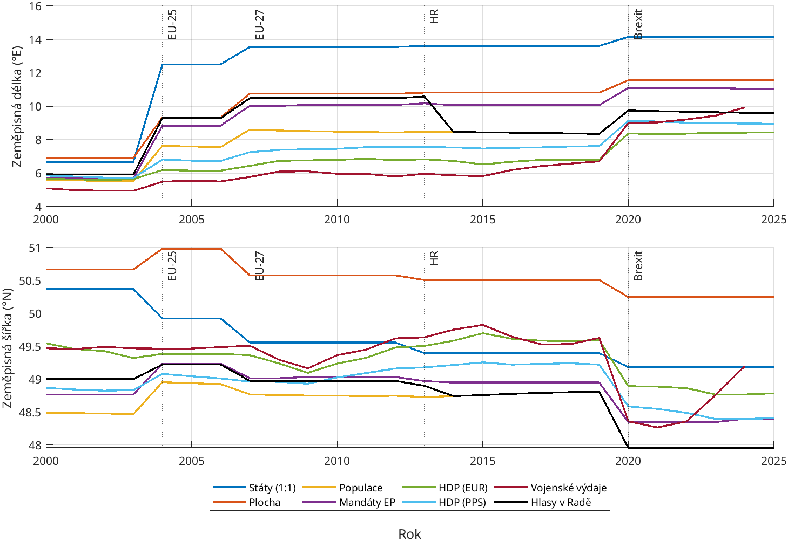
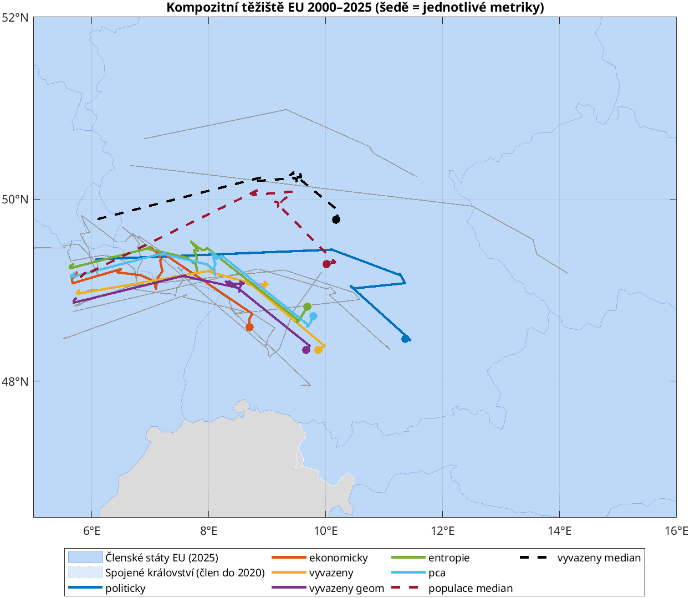
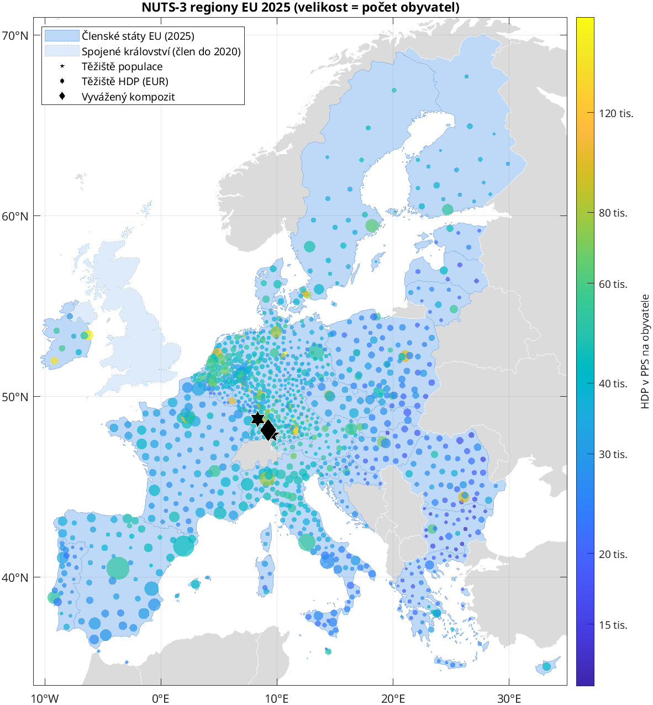
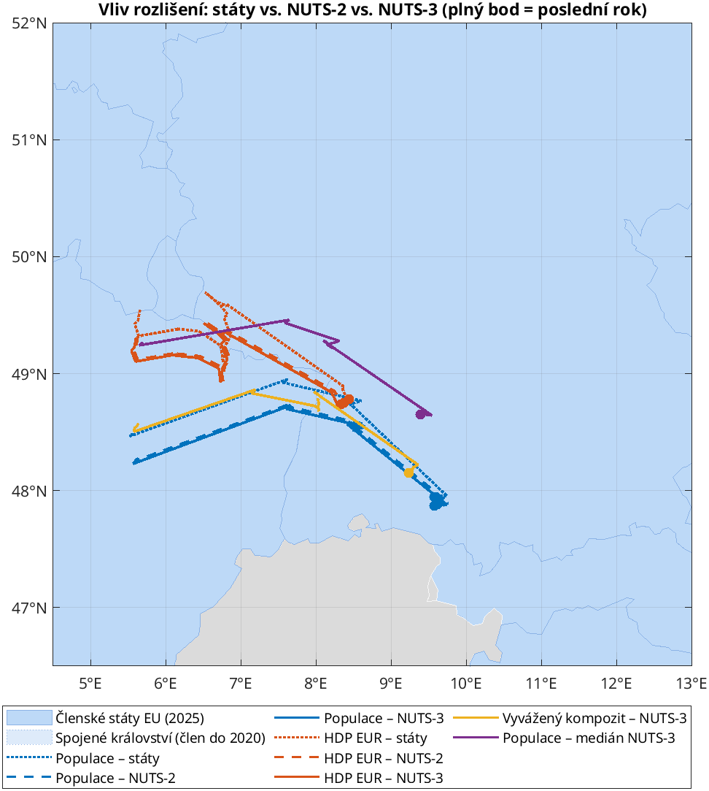
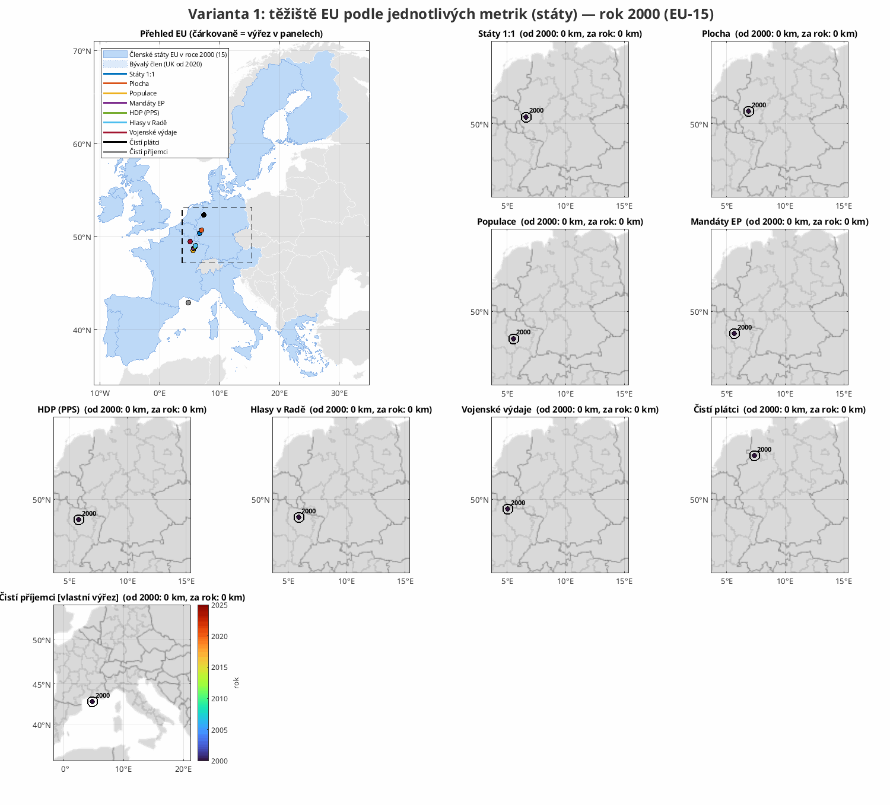
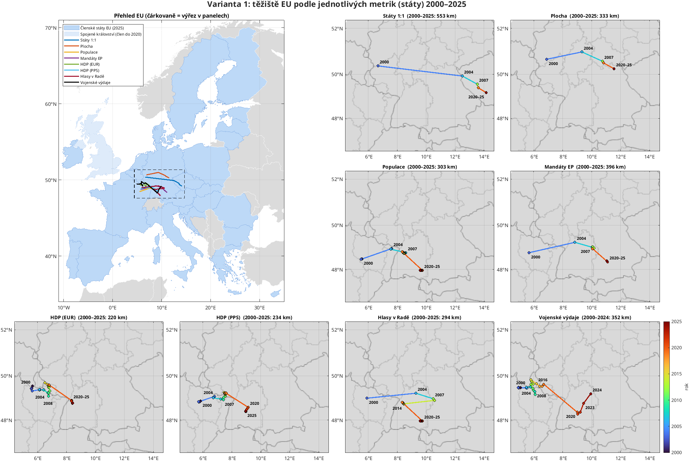
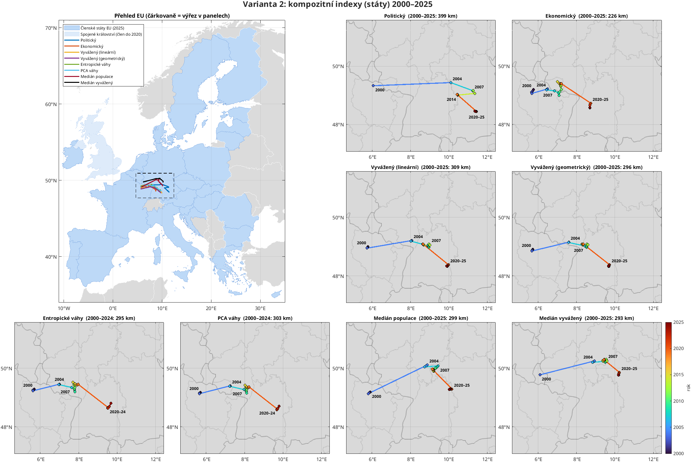

# Geografické těžiště EU 2000–2025 (MATLAB)

Kam se posouvá „střed“ Evropské unie, když ho vážíme hlasy v Radě, mandáty v EP,
obyvatelstvem nebo ekonomikou? A jak s ním pohnula rozšíření 2004/2007/2013 a brexit?

Projekt počítá těžiště ve třech variantách: podle jednotlivých metrik (každý stát jako
jeden bod), jako kompozitní index více metrik a na úrovni regionů NUTS-2/NUTS-3. Výsledky
jsou mapy a animace posunu rok po roku. Všechno běží v základním MATLABu nad živými daty
Eurostatu.

## Spuštění

```matlab
cd eu-teziste-matlab   % kořen repozitáře
run_all          % = main; kompozit; main_nuts; mapy_posunu; animace_posunu
```

Při prvním běhu se stáhnou data z Eurostat API do `data/raw/` (obyvatelstvo `demo_pjan`,
HDP `nama_10_gdp`). Pro aktualizaci stačí `data/raw/*.csv` smazat. Testováno v R2023b, stačí
základní MATLAB. Mapy kreslí vlastní třída `src/EuMap.m` na obyčejných osách, takže
nepotřebují Mapping Toolbox ani podkladové dlaždice z internetu. Členské státy EU jsou
světle modré, Spojené království (člen do 2020) světlejší a ostatní státy šedé.

| Soubor | Obsah |
|---|---|
| `run_all.m` | spustí všechno níže v tomto pořadí |
| `main.m` | úroveň států: data → váhy → těžiště → souhrn → grafy |
| `mapy_posunu.m` | mapy posunů rok po roku pro všechny tři varianty (`results/posuny_*.png`) |
| `animace_posunu.m` | totéž jako animované GIFy, jeden snímek na rok (`results/animace_*.gif`) |
| `src/tracks_figure.m`, `src/tracks_set_year.m` | sdílené sestavení mapy posunů a její vykreslení „do roku Y“ (statika i animace) |
| `kompozit.m` | kompozitní indexy na úrovni států |
| `main_nuts.m` | regiony NUTS-2 / NUTS-3: demografie + ekonomika, kompozity, medián |
| `src/composite_weights.m` | skládání metrik: lineárně / geometricky, váhy ručně / entropie / PCA |
| `src/geometric_median.m` | Weberův bod na kouli (Weiszfeld + Vardi–Zhang) |
| `src/regional_weights.m` | rozpočet národních součtů do regionů NUTS (díry v datech, verze NUTS) |
| `src/choose_nuts_versions.m` | společná verze NUTS pro všechny metriky v daném státě a roce |
| `src/EuMap.m` | třída pro mapy: projekce, státy EU / UK / ostatní (hranice GISCO), `line`/`scatter`/`text` v lat/lon |
| `src/load_nuts_geometry.m` | polygony GISCO → těžiště a plocha regionů (`polyshape`) |
| `src/spherical_centroid.m` | vážené těžiště na kouli (přes 3D vektory) |
| `src/council_rule.m` | pravidla kvalifikované většiny: Amsterdam (EU-15), Nice, Lisabon |
| `src/banzhaf_mc.m` | Banzhafův index hlasovací síly (Monte Carlo) |
| `src/fetch_eurostat.m` | stahování a parsování JSON-stat z Eurostatu, cache |
| `src/is_member.m` | matice členství rok × stát (k 31. 12.) |
| `data/countries.csv` | státy, přibližné středy území, plocha, data vstupu/odchodu |
| `data/council_votes.csv` | vážené hlasy v Radě: EU-15 (87) a Nice (až 352) |
| `data/ep_seats.csv` | mandáty v EP po volebních obdobích 1999–2024 |
| `results/` | CSV a PNG ze všech tří skriptů (viz níže) |

## Metoda

Každý stát *i* má bod (φᵢ, λᵢ) a váhu wᵢ. Bod se převede na jednotkový vektor
**xᵢ** = (cos φ cos λ, cos φ sin λ, sin φ), spočítá se vážený průměr Σ wᵢ**xᵢ** / Σ wᵢ
a promítne se zpět na povrch. Prostý průměr stupňů by byl chybný, protože jeden stupeň
délky měří na Kypru (35° s. š.) asi o 30 % víc než ve Finsku (64° s. š.).

Referenční datum je 31. 12. daného roku. Rok 2004 je tedy už EU-25, 2013 zahrnuje
Chorvatsko a 2020 už nezahrnuje Spojené království.

## Co je Banzhafova síla v Radě

V Radě EU se většina rozhodnutí přijímá **kvalifikovanou většinou**. Počet hlasů, které
stát má, ale neříká, jak velký má vliv. Vliv má stát jen tehdy, když jeho hlas
**rozhoduje**, tj. když koalice s ním návrh prosadí a bez něj ne. Takový stát je
v dané koalici **„swing“** (jazýček na vahách).

**Banzhafův index** spočítá pro každý stát, v kolika ze všech možných koalic je swing,
a normalizuje to tak, aby součet přes státy byl 100 %. Odpovídá na otázku: *jakou část
skutečné rozhodovací moci stát drží*, pokud předpokládáme, že každá koalice je stejně
pravděpodobná. Pro 27 států je koalic 2²⁷ ≈ 134 milionů, proto `banzhaf_mc.m` index
odhaduje Monte Carlem (náhodné koalice, chyba ~0,1 %).

**Proč se váha a síla liší (výpočet z dat projektu):**

| Stát | 2003, EU-15: hlasy → síla | 2010, Nice: hlasy → síla | 2025, Lisabon: populace → síla |
|---|---|---|---|
| Německo | 11,5 % → 11,2 % | 8,4 % → 7,8 % | 18,6 % → **12,1 %** |
| Španělsko | 9,2 % → 9,2 % | 7,8 % → 7,4 % | 10,9 % → 7,8 % |
| Polsko | – | 7,8 % → 7,5 % | 8,1 % → 6,2 % |
| Česko | – | 3,5 % → 3,7 % | 2,4 % → 3,0 % |
| Lucembursko | 2,3 % → 2,3 % | 1,2 % → 1,3 % | 0,15 % → **1,75 %** |

- **Nice (2004–2014):** Polsko a Španělsko měly s 27 hlasy prakticky stejnou sílu jako
  Německo s 29, přestože mělo dvakrát víc obyvatel.
- **Lisabon (od 2014):** „hlasem“ je podíl na populaci, ale skutečná síla je jiná.
  Německo má 18,6 % obyvatel a jen 12,1 % síly. Lucembursko má 0,15 % obyvatel
  a 1,75 % síly, protože druhá podmínka (55 % **států**) dává každému státu stejnou váhu.
- Extrémní příklad je EHS v roce 1958: Lucembursko mělo 1 hlas ze 17, ale jeho síla
  byla **0 %**. Ostatní státy měly sudé počty hlasů a kvóta byla 12, takže jeho hlas
  nikdy nic nerozhodl. Přesný výpočet ze všech 64 koalic to potvrzuje.

V projektu jsou proto dvě metriky. **Hlasy v Radě** jsou formální váha (od roku 2014
totožná s populací). **Banzhafova síla v Radě** je skutečný vliv a její těžiště leží
o ~160 km východněji (2025), protože malé státy (často na východě) mají víc síly, než by
odpovídalo jejich velikosti.

## Návrhy metrik

Metriky ✅ jsou implementované, ostatní jsou návrhy na další práci.

### Politická váha

| Metrika | Co měří | Zdroj |
|---|---|---|
| ✅ **Státy 1:1** | „jeden stát, jeden hlas“: Komise (1 komisař/stát), jednomyslnost, Evropská rada | definice |
| ✅ **Hlasy v Radě EU** | 2000–2003 vážené hlasy EU-15 (87), 2004–2013 Nice (321/345/352), od 2014 dvojí většina, kde hlasem je populace | smlouvy |
| ✅ **Banzhafova síla v Radě** | jak často je stát rozhodující pro vznik většiny. Váha hlasů a skutečná moc se liší: podle Nice měly Polsko a Španělsko s 27 hlasy téměř stejnou sílu jako Německo s 29 | výpočet |
| ✅ **Mandáty v EP** | degresivní proporcionalita, malé státy jsou nadreprezentované | rozhodnutí o složení EP |
| Shapley–Shubikův index | alternativa k Banzhafovi (záleží na pořadí, ve kterém se koalice skládá) | výpočet |
| Síla v Radě guvernérů ECB | jen eurozóna, rotující hlasovací práva od 2015 | ECB |
| Kapitálový klíč ECB | 50 % populace + 50 % HDP, mění se po 5 letech | ECB |
| Váha frakcí v EP | těžiště EPP vs. S&D vs. Renew atd. (kde „sedí“ která frakce) | EP, ParlGov |

### Demografie a území

| Metrika | Poznámka |
|---|---|
| ✅ **Populace** (1. 1., Eurostat) | základní metrika, od 2014 totožná s hlasy v Radě |
| ✅ **Plocha** | čistě geometrické těžiště, Skandinávie táhne na sever |
| Populace 20–64 let / pracovní síla | ukáže stárnutí, v Itálii a ve východní Evropě rychlejší |
| Migrace (čisté saldo) | těžiště toho, *kam* se lidé stěhují |

### Ekonomika

| Metrika | Poznámka |
|---|---|
| ✅ **HDP v EUR (běžné ceny)** | ekonomická váha na trhu. Výrazně západněji než populace |
| ✅ **HDP v PPS** | HDP očištěné o cenové hladiny, východ v něm váží víc |
| Rozpočet EU: příspěvky / čistá pozice | těžiště plátců vs. příjemců. Dva body, mezi kterými se dá měřit vzdálenost |
| Vnitrounijní obchod (export do EU) | těžiště jednotného trhu |
| Přímé zahraniční investice uvnitř EU | kam proudí kapitál |
| Emise CO₂ / spotřeba energie | těžiště klimatického břemene |

### Kombinované a kontrafaktuální scénáře

- **Složený index** = vážená kombinace normalizovaných metrik. Váhy nastaví uživatel,
  případně se odvodí z PCA.
- **Podmnožiny:** eurozóna (vývoj 12 → 21 států), Schengen, NATO-EU.
- **Kontrafaktuál „bez brexitu“:** UK zůstává po roce 2020 (populace z ONS).
- **Budoucí rozšíření:** Ukrajina, Moldavsko, západní Balkán. Zajímavé je, kolik zemí
  přibude a jak velký skok těžiště to způsobí.

## Výsledky (první běh, data Eurostatu ke 2026-10)

Posun 2000 → 2025 (`results/souhrn_posunu.csv`):

| Metrika | 2000 | 2025 | Posun | Směr |
|---|---|---|---|---|
| Státy 1:1 | 50,37 N 6,66 E (Lucembursko/Porýní) | 49,18 N 14,15 E (**jižní Čechy**) | **553 km** | V |
| Banzhafova síla v Radě | 49,10 N 5,97 E | 48,53 N 11,53 E (Bavorsko) | 412 km | V |
| Mandáty v EP | 48,77 N 5,68 E | 48,40 N 11,04 E | 396 km | V |
| Plocha | 50,67 N 6,90 E | 50,25 N 11,55 E (Durynsko) | 333 km | V |
| Populace | 48,48 N 5,57 E (Lotrinsko) | 47,95 N 9,58 E (u Bodamského jezera) | 303 km | V |
| Hlasy v Radě | 49,00 N 5,92 E | 47,95 N 9,58 E | 294 km | VJV |
| HDP v PPS | 48,87 N 5,85 E | 48,41 N 8,96 E | 234 km | V |
| HDP v EUR | 49,54 N 5,66 E | 48,78 N 8,44 E (Bádensko-Württembersko) | 220 km | VJV |

Co je z toho vidět:

1. **Skoky dělají rozšíření a brexit, ne demografie.** Populační těžiště se posunulo
   o 164 km při rozšíření 2004, o 79 km v roce 2007 a o 141 km při brexitu 2020.
   V ostatních letech se meziročně hýbe jen o 1–4 km.
2. **Čím „rovnostářštější“ metrika, tím dál na východ.** Pořadí od západu na východ je
   HDP → populace → EP → Banzhaf → státy 1:1. Malé východní státy mají v institucích
   víc váhy, než odpovídá jejich obyvatelstvu, a ještě víc v poměru k jejich ekonomice.
3. **Mezi rozšířeními se populační těžiště plíží zpátky na západ** (2007–2019 z 8,61° na 8,35° v. d.,
   2020–2025 z 9,75° na 9,58° v. d.). Příčinou je vylidňování východu a jihovýchodu
   a migrace na západ.
4. **Ekonomické těžiště se mezi rozšířeními naopak posouvá na východ** (HDP v EUR
   2004–2019 z 6,18° na 6,81° v. d.). To je ekonomická konvergence nových členů.
5. **Lisabonská reforma 2014 posunula těžiště hlasů v Radě o ~150 km na západ**
   (viz skok červené křivky v `casove_rady.png`). Systém z Nice nadhodnocoval
   středně velké státy, hlavně Polsko a Španělsko, a dvojí většina tuto výhodu
   přesunula k Německu.
6. Brexit posunul **všechny** metriky na jihovýchod, protože UK leželo na severozápadním
   okraji.




## Kompozitní index (`kompozit.m`)

Metriky mají různé jednotky (lidé, EUR, hlasy, km²), proto se každá nejdřív převede
na **podíl státu na EU** v daném roce (součet = 1). Teprve tyto podíly se skládají.

**Dva způsoby složení:**

- **Lineární** w = Σ αₖ·sₖ. Těžiště takového kompozitu je přesně vážený průměr
  těžišť jednotlivých metrik (ve 3D, před promítnutím na povrch). Je průhledné,
  ale nepřináší nic, co by nešlo dopočítat z jednotlivých metrik.
- **Geometrický** w = Π sₖ^αₖ (jako u HDI). Trestá nevyváženost: stát velký
  populací, ale ekonomicky slabý, dostane méně než průměr svých podílů. Metrika,
  která je u všech stejná (státy 1:1), se v geometrickém kompozitu vůbec neprojeví.

**Tři způsoby, jak zvolit váhy αₖ:**

- **Ručně (předvolby):** politický (Banzhaf 0,4 + EP 0,3 + státy 0,3), ekonomický
  (HDP EUR + PPS), vyvážený (⅓ populace, ⅓ politika, ⅓ ekonomika).
- **Entropické váhy:** metrika rozložená mezi státy nerovnoměrněji nese víc
  informace. Státy 1:1 tak dostanou 0 a HDP v EUR nejvíc (0,25).
- **PCA (postup OECD Handbook):** čtverce ladění 1. hlavní komponenty. Vychází
  skoro rovnoměrně (~0,18), protože metriky spolu silně korelují.

**Jiný způsob, jak spojit více proměnných:** místo těžiště (průměru) se dá hledat
**geometrický medián**, tedy bod s nejmenším součtem vážených vzdáleností („kam
dát hlavní město“). Medián nepřitáhne několik vzdálených bodů (Kypr, Finsko).
Navíc může legitimně padnout přímo na některý stát: vyvážený medián pro rok 2000
leží přesně v Lucembursku. Ověřil jsem to hrubou sítí i `fminsearch`.

| Varianta | 2000 | 2025 | Posun |
|---|---|---|---|
| Politický | 49,38 N 6,08 E | 48,69 N 12,16 E | 449 km |
| Vyvážený (lineární) | 49,02 N 5,80 E | 48,42 N 10,14 E | 325 km |
| PCA | 49,13 N 5,87 E | 48,61 N 10,09 E | 314 km |
| Vyvážený (geometrický) | 48,93 N 5,74 E | 48,43 N 9,86 E | 307 km |
| Entropie | 49,23 N 5,89 E | 48,70 N 9,72 E | 286 km |
| Ekonomický | 49,20 N 5,75 E | 48,59 N 8,70 E | 226 km |
| Medián populace | 49,20 N 5,90 E | 49,29 N 10,02 E | 299 km |
| Medián vyvážený | 49,78 N 6,10 E | 49,81 N 10,31 E | 302 km |

Medián leží asi o 1° severněji než těžiště, protože ho jih (Itálie, Španělsko,
Řecko, Kypr) netáhne tolik. Geometrický kompozit je o 0,3° západněji než lineární:
penalizuje státy s vysokou populací a nízkým HDP, tedy hlavně východ.



## Regiony NUTS-2 / NUTS-3 (`main_nuts.m`)

Místo jednoho bodu na stát se počítá s regiony NUTS-2 (~240) nebo NUTS-3 (~1 100–1 300
podle verze). Bod regionu je těžiště jeho polygonu z GISCO. Zámořská území se vyřazují
a jejich váha zůstává státu. Metriky jsou jen demografické a ekonomické:

| Metrika | Dataset Eurostatu | Roky |
|---|---|---|
| populace | `demo_r_pjanaggr3` | 2000–2025 |
| populace 15–64 let | `demo_r_pjanaggr3` | 2000–2025 |
| zaměstnanost | `nama_10r_3empers` (národní záloha `nama_10_pe`) | 2000–2024 |
| HDP EUR, HDP PPS | `nama_10r_3gdp` (národní záloha `nama_10_gdp`) | 2000–2024 |
| plocha | z polygonů | – |

Kompozity: demografický (populace + 15–64), ekonomický (HDP EUR 0,4, PPS 0,3,
zaměstnanost 0,3), vyvážený, geometrický, entropie, PCA.

**Data jsou děravá, proto se nepoužívají přímo.** Pro každý stát a rok se vezme:

1. národní součet (sedí na národní statistiky),
2. rozdělení uvnitř státu podle regionů z nejbližšího roku, kde je pro danou verzi
   NUTS pokrytí kompletní (např. HDP za rok 2025 má rozložení z let 2023/24),
3. verze NUTS (2010–2024) společná pro všechny metriky daného státu a roku. Bez toho
   by v geometrickém kompozitu region, který v jedné metrice chybí, dostal nulu.
   Tuhle chybu jsem v prvním běhu opravdu chytil: geometrický kompozit za rok 2000
   ujel o 1° na západ.
4. **UK:** Eurostat z regionálních účtů vyřadil HDP i zaměstnanost UK, proto se
   národní součet UK rozděluje podle regionální populace (aproximace pro 2000–2019).

**Výsledky na NUTS-3:**

| Metrika | 2000 | 2025 | Posun |
|---|---|---|---|
| Plocha | 50,67 N 6,99 E | 50,24 N 11,66 E | 334 km |
| Zaměstnanost | 48,61 N 5,54 E | 48,11 N 9,64 E | 308 km |
| Populace | 48,25 N 5,61 E | 47,87 N 9,58 E | 298 km |
| Populace 15–64 | 48,20 N 5,66 E | 47,84 N 9,57 E | 294 km |
| Kompozit vyvážený | 48,57 N 5,64 E | 48,15 N 9,23 E | 270 km |
| Kompozit ekonomický | 48,92 N 5,64 E | 48,45 N 8,89 E | 244 km |
| HDP PPS | 48,72 N 5,78 E | 48,39 N 8,87 E | 230 km |
| HDP EUR | 49,31 N 5,60 E | 48,74 N 8,33 E | 209 km |
| Medián populace | 49,26 N 5,70 E | 48,65 N 9,39 E | 278 km |

**Co z toho plyne:**

- **Jemnější rozlišení na výsledku skoro nic nemění.** Pro rok 2025 je rozdíl mezi
  těžištěm ze států a z NUTS-3 jen 7–9 km. V roce 2000 je to u populace a HDP
  ~25 km (NUTS-3 vychází jižněji). Uvnitř států je populace rozložená jinak, než leží
  středy jejich území, ale na úrovni celé EU se tyto odchylky z velké části vyruší.
- Zaměstnanost se posunula o něco víc než populace (308 vs. 298 km). Příčinu by
  bylo potřeba ověřit rozkladem posunu po státech.
- Pracovní populace (15–64) leží o pár km jižněji a západněji než celá populace,
  ale rozdíl je malý.




## Mapy posunů rok po roku (`mapy_posunu.m`)

Pro každou variantu je jedna mapa: vlevo nahoře přehled celé EU (všechny řady,
čárkovaně výřez, členské státy modře), pak přiblížený panel pro každou řadu
na neutrálním šedém podkladu (`grayland`). Každý rok je bod obarvený
podle roku a sousední roky spojuje úsečka, tedy posun během daného roku. Popsané
jsou první a poslední rok a skoky nad 25 km. Body blíž než 20 km se popíší rozsahem
(„2020–25“). Všechny panely jedné mapy mají stejný výřez, takže jsou délky posunů
srovnatelné.

**Animace** (`animace_posunu.m`) mají stejné rozvržení, jeden snímek na rok 2000–2025:

- trajektorie se kreslí postupně a aktuální rok je zakroužkovaný,
- v nadpisu panelu je posun od roku 2000 a posun za daný rok,
- na přehledové mapě jsou modře státy, které byly v daném roce členy EU
  (EU-15 → 25 → 27 → 28 → 27), a UK je od roku 2020 světlé jako bývalý člen,
- snímek běží 0,7 s, roky rozšíření, brexitu a změny pravidel v Radě (2004, 2007,
  2013, 2014, 2020) dvojnásobně dlouho a poslední snímek 4 s.

Technicky: obrázek se sestaví jednou a pro každý rok se jen přepnou data a viditelnost
objektů (`tracks_set_year`). Snímky se zachytí přes `print -RGBImage` a uloží se se
společnou paletou přes `rgb2ind` + `imwrite`. Funguje to i v `matlab -batch`.







## Zdroje dat a licence

- Obyvatelstvo, HDP, zaměstnanost: © European Union, Eurostat (`demo_pjan`, `nama_10_gdp`,
  `nama_10_pe`, `demo_r_pjanaggr3`, `nama_10r_3gdp`, `nama_10r_3empers`), CC BY 4.0.
- Hranice států a regionů NUTS: © EuroGeographics for the administrative boundaries (GISCO).
- Vážené hlasy v Radě a mandáty v EP: smlouvy EU a rozhodnutí o složení Evropského
  parlamentu (ručně přepsáno do `data/`).

Stažená data se ukládají do `data/raw/`, která není v repozitáři. Při prvním běhu se
stáhne vše potřebné.

## Zjednodušení a známé limity

- **Stát = jeden bod** v `main.m`/`kompozit.m` (přibližný střed území). NUTS-3 ukazuje,
  že výsledná chyba je na úrovni EU jen 7–25 km.
- NUTS: regionální rozložení v letech bez dat se přebírá z nejbližšího roku a UK
  se ekonomicky rozpočítává podle populace.
- Přechodná období se ignorují: hlasy v Radě květen–říjen 2004, volitelný systém
  z Nice v letech 2014–2017, 18 dodatečných poslanců EP od prosince 2011.
- Pravidlo z Nice počítá s populační pojistkou 62 % vždy (ve skutečnosti se uplatňovala jen na žádost).
- Banzhaf je odhad Monte Carlem s 1e5 koalicemi, chyba je v řádu 0,1 %.
- Zámořská území (Kanárské ostrovy, Azory, francouzské DOM) se ve středu státu nepočítají.
  Do populace a HDP z Eurostatu ale zahrnutá jsou.

## Další kroky (návrh roadmapy)

1. ~~NUTS-3 rozlišení~~ hotovo (`main_nuts.m`). Dál: ekonomická data UK z ONS
   (ITL3) místo populační proxy, mřížka 1 km² (GEOSTAT) pro populaci.
2. **Přesný Banzhaf** pomocí generujících funkcí / dynamického programování místo MC
   (u dvojí většiny je to 2D DP: počet států × populace). To je dobrá ukázka algoritmu.
3. **Bootstrap / citlivostní analýza:** jak moc se těžiště pohne, když středy států posuneme
   o ±50 km.
4. ~~Animace~~ hotovo (`animace_posunu.m`). Dál: MP4 přes `VideoWriter` pro prezentace.
5. **Unit testy** (`matlab.unittest`): těžiště dvou bodů na rovníku, symetrie, kontrolní
   součty hlasů (87/321/345/352) a mandátů.
6. **App Designer GUI:** zaškrtávání metrik, slider roku, posuvníky vah kompozitu
   (`composite_weights` je na to připravená).
7. **Live Script** (`.mlx`) jako prezentační verze do portfolia.
8. **Nejistota kompozitu:** Monte Carlo přes náhodné váhy α (Dirichlet), výsledkem je
   „oblak“ možných těžišť místo jednoho bodu. To je poctivější odpověď na otázku,
   kde je střed EU.
