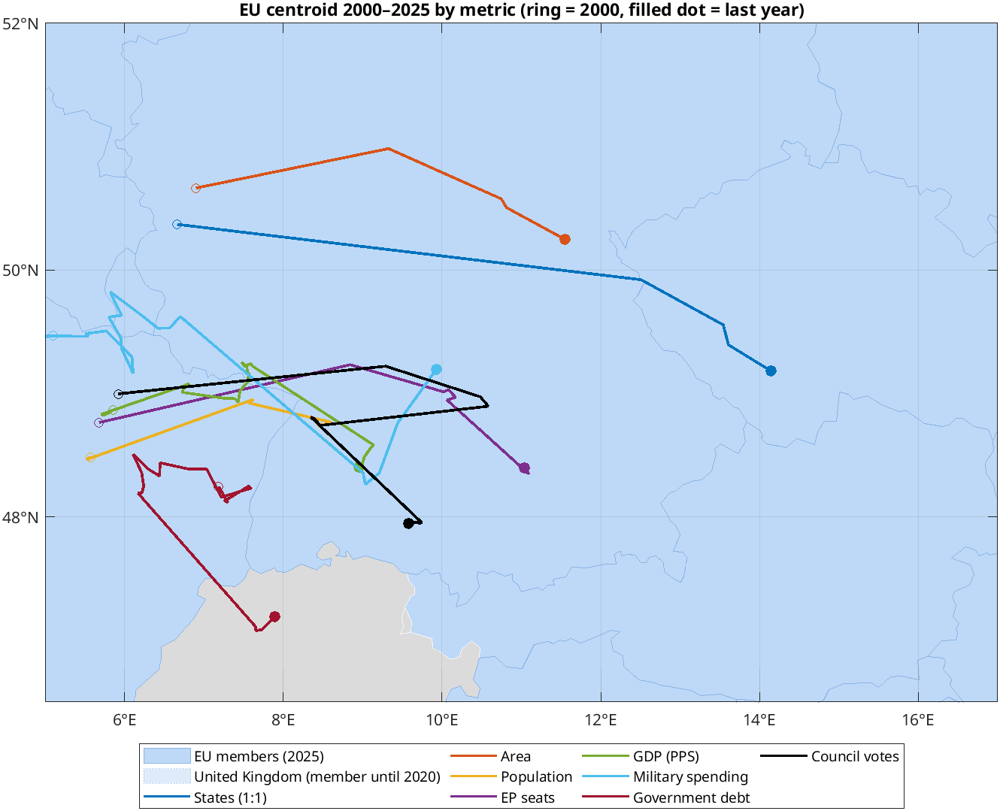
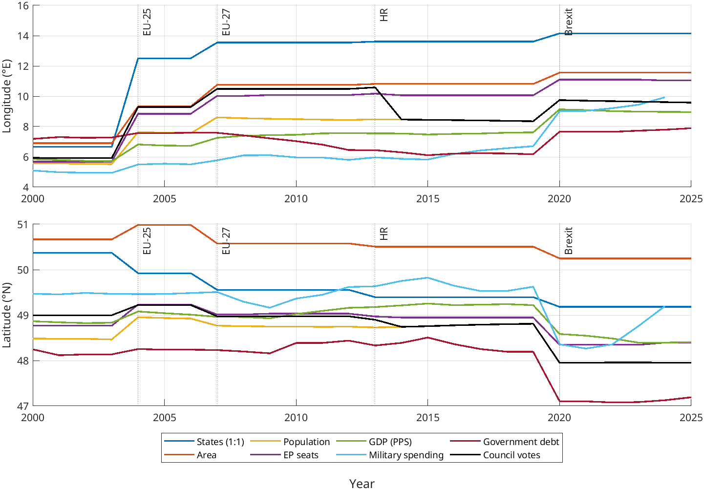
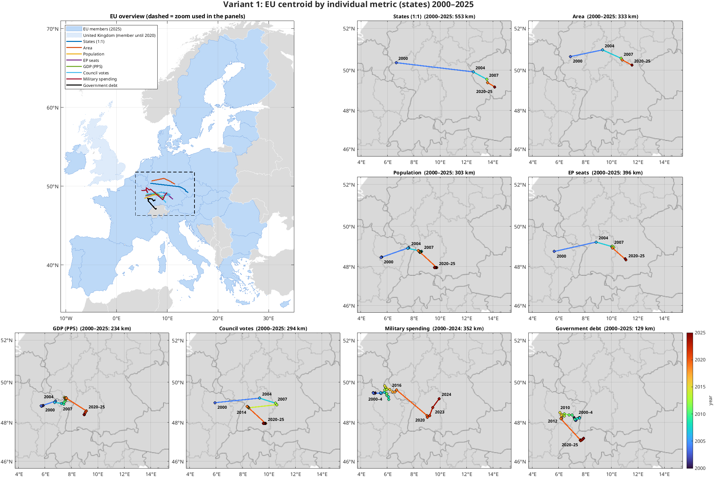
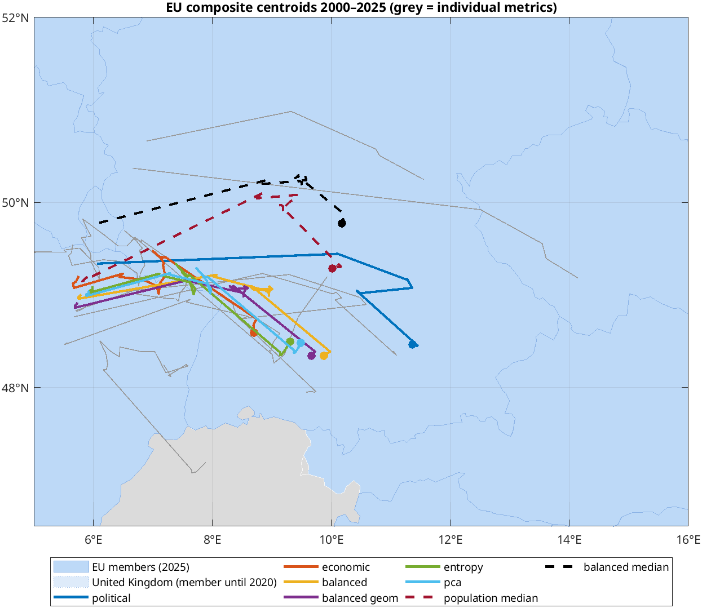
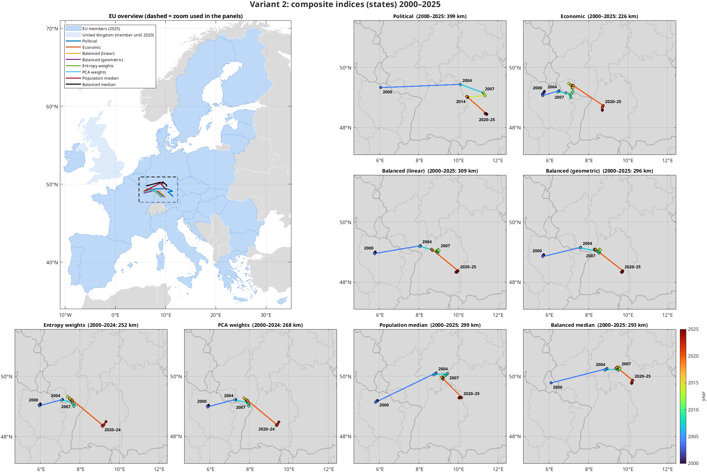
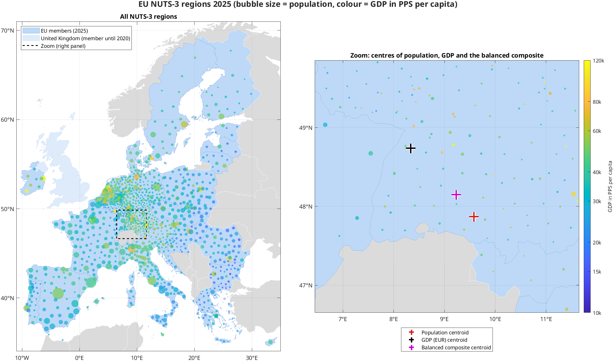
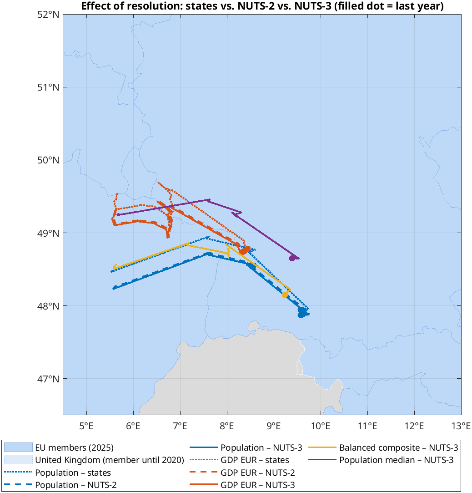
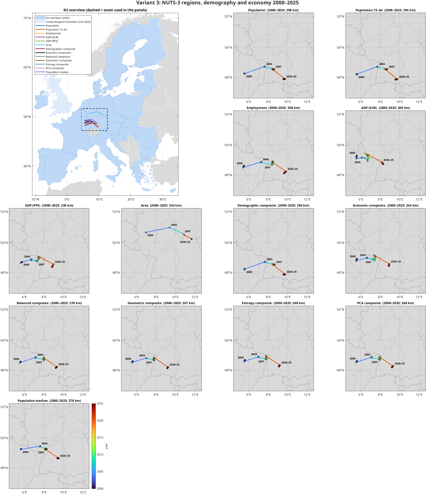
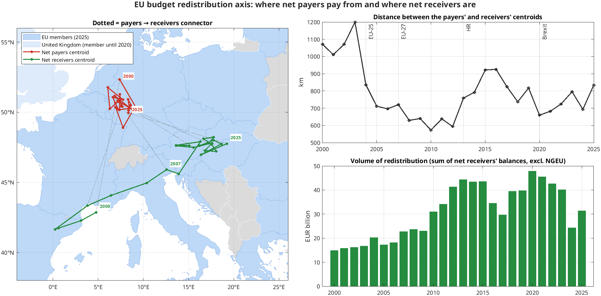
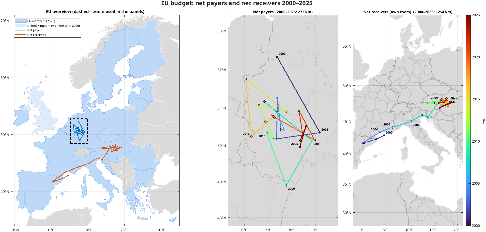

# Geographic centroid of the EU, 2000–2025 (MATLAB)

Where is the "centre" of the European Union, and how has it moved since 2000? The
answer depends on what you weigh the member states by: votes in the Council, seats in
the European Parliament, population, GDP, military spending, government debt, or the
EU budget. This project computes the centroid for each of these metrics, for composite
indices that combine several of them, and at the level of ~1,100 NUTS-3 regions. It
tracks how the centroid moved through the 2004/2007/2013 enlargements and Brexit.

Everything runs in base MATLAB (no toolboxes required) on live data from Eurostat, the
European Commission, the World Bank (SIPRI) and the IMF.


## Quick start

```matlab
cd eu-teziste-matlab   % repository root
run_all                % = main; composite; main_nuts; budget; shift_maps; shift_animations
```

On the first run all data are downloaded into `data/raw/` (tens of MB; about 5 MB stays
cached). Later runs work offline. To refresh the data, delete `data/raw/`. Tested in
MATLAB R2023b. A full run takes about 10 minutes, most of it rendering the animations.

## Repository structure

| File | Purpose |
|---|---|
| `run_all.m` | runs every script below in order |
| `main.m` | variant 1: centroid by individual metric, countries as points |
| `composite.m` | variant 2: composite indices and geometric medians |
| `main_nuts.m` | variant 3: NUTS-2 / NUTS-3 regions (demography and economy) |
| `budget.m` | EU budget net payers / net receivers (standalone outputs) |
| `shift_maps.m` | static year-by-year shift maps for the three variants |
| `shift_animations.m` | the same maps as animated GIFs |
| `src/spherical_centroid.m` | weighted centroid on a sphere (via 3D unit vectors) |
| `src/geometric_median.m` | weighted Weber point on a sphere (Weiszfeld + Vardi–Zhang) |
| `src/centroid_series.m` | centroid or median for every year of a weight matrix |
| `src/council_rule.m` | qualified-majority rules: Amsterdam (EU-15), Nice, Lisbon |
| `src/banzhaf_mc.m` | Banzhaf voting-power index (Monte Carlo), see the explanation below |
| `src/shares.m`, `src/composite_weights.m` | combining metrics: linear / geometric, hand-set / entropy / PCA weights |
| `src/regional_weights.m`, `src/choose_nuts_versions.m`, `src/nuts_split.m`, `src/nuts_index_data.m` | splitting national totals into NUTS regions despite data gaps and changing NUTS versions |
| `src/load_nuts_geometry.m` | GISCO polygons → centroid and area of every region (`polyshape`) |
| `src/eu_budget_balance.m` | operating budgetary balance of every country from the Commission's workbook |
| `src/fetch_eurostat.m`, `src/fetch_worldbank.m`, `src/fetch_imf.m` | API clients with on-disk cache |
| `src/EuMap.m` | map class: projection, EU / UK / other countries, `line` / `scatter` / `text` in lat/lon |
| `src/tracks_figure.m`, `src/tracks_set_year.m` | shared shift-map figure, drawn "up to year Y" (static map and every animation frame) |
| `src/place_labels.m`, `src/geo_pixel_map.m` | year labels placed so that they never cover the tracks |
| `src/plot_*.m`, `src/animate_tracks.m`, `src/shift_variants.m`, `src/metric_labels.m` | charts |
| `data/countries.csv` | countries, approximate territorial centres, area, ISO3 code, accession / exit dates |
| `data/council_votes.csv` | weighted Council votes: EU-15 (87) and Nice (up to 352) |
| `data/ep_seats.csv` | EP seat allocation per term, 1999–2024 |
| `results/` | CSV results, PNG charts and GIF animations (described below) |

## Methodology

### Centroid on a sphere

Each unit *i* (a country or a region) is a point (φᵢ, λᵢ) with a weight wᵢ. The point is
converted to a unit vector **xᵢ** = (cos φ cos λ, cos φ sin λ, sin φ). The centroid is the
weighted mean Σ wᵢ**xᵢ** / Σ wᵢ projected back onto the surface. A plain average of
latitudes and longitudes would be wrong: a degree of longitude is about 30 % longer in
Cyprus (35° N) than in Finland (64° N). Distances are great-circle (haversine) distances.

### Membership and the reference date

Each year uses the membership on **31 December**. 2004 is therefore already EU-25, 2013
includes Croatia, and 2020 no longer includes the United Kingdom (it left on 31 January
2020). Non-members get zero weight.

### Metrics (variant 1, countries as points)

Each country is one point: an approximate centre of its European territory
(`data/countries.csv`; overseas territories excluded). Its weight in a given year is:

| Metric | Weight | Source |
|---|---|---|
| States (1:1) | 1 per member: "one state, one vote" (Commission, unanimity, European Council) | definition |
| Area | km² | `data/countries.csv` |
| Population | population on 1 January | Eurostat `demo_pjan` |
| EP seats | seats in the European Parliament (degressive proportionality) | `data/ep_seats.csv` |
| GDP (PPS) | GDP in purchasing power standards (corrected for price levels) | Eurostat `nama_10_gdp` |
| Council votes | 2000–2003 weighted votes EU-15 (87), 2004–2013 Nice weights (321/345/352), from 2014 population (double majority) | treaties, `data/council_votes.csv` |
| Military spending | nominal military expenditure, current USD, 2000–2024 | SIPRI via World Bank `MS.MIL.XPND.CD` |
| Government debt | general government gross debt (Maastricht definition), EUR million | Eurostat `gov_10dd_edpt1`; UK = IMF debt-to-GDP × Eurostat GDP |

GDP in EUR (`nama_10_gdp`, current prices) is also computed and stored in
`results/centroids_by_year.csv`. It is used by the composites and as the national total in
the NUTS variant, but it is not shown in the charts.

**Why nominal values and not % of GDP.** A centroid weight must measure *how much* there
is, not intensity. Weighting by military spending in % of GDP would give Greece (~3 %)
more pull than Germany, which spends several times more. The currency does not matter
either, because each year only the countries' shares are used.

**Gaps filled for the United Kingdom.** Eurostat has removed the UK from several datasets.
Military spending therefore comes from SIPRI (complete for all 28 countries, including the
UK). UK government debt for 2000–2019 is the IMF World Economic Outlook debt-to-GDP ratio
times Eurostat's UK GDP in EUR. For EU members the IMF figures match Eurostat exactly
(Germany 2000: 59.2 % in both).

### Composite indices (variant 2)

Metrics have different units, so every metric is first turned into **each country's share
of the EU total** in that year (shares sum to 1). Only then are they combined:

- **Linear:** w = Σ αₖ·sₖ. Its centroid is exactly the weighted average of the centroids of
  the individual metrics (in 3D, before projecting to the surface).
- **Geometric:** w = Π sₖ^αₖ (as in the Human Development Index). It penalises imbalance:
  a country large by population but poor gets less than the average of its shares. A
  metric that is equal for every country (states 1:1) has no effect at all.

Weights αₖ are set in three ways:

- **Hand-set presets:** *political* (Council votes 0.4, EP seats 0.3, states 0.3),
  *economic* (GDP EUR 0.5, GDP PPS 0.5), *balanced* (⅓ population, ⅓ political, ⅓ economic).
- **Entropy weights:** a metric that is spread more unevenly across countries carries more
  information and gets a larger weight. States 1:1 gets 0. Military spending and debt get
  the most (0.19 each), because they are concentrated in a few large countries.
- **PCA weights** (OECD Handbook on Composite Indicators): squared loadings of the first
  principal component of the standardised shares. They come out almost equal (~0.15),
  because the metrics are strongly correlated.

Entropy and PCA leave out Council votes, which equal population from 2014 and would
count it twice. Because they include military spending, they end in 2024.

**Geometric median.** Besides the centroid (a mean), the project computes the **weighted
geometric median**: the point with the smallest sum of weighted distances ("where to put
the capital"). Unlike the mean, a few remote points (Cyprus, Finland) do not pull it.
The median can legitimately sit exactly on a data point: the balanced median for 2000 is
exactly Luxembourg. This was verified with a brute-force grid and `fminsearch`.

### NUTS-2 / NUTS-3 regions (variant 3)

Instead of one point per country there are ~240 NUTS-2 or ~1,100–1,300 NUTS-3 regions
(depending on the NUTS version). Each region's point is the centroid of its GISCO polygon.
Outermost regions (French overseas departments, Canaries, Azores, Madeira) are dropped
from the coordinates; their weight stays with the country. Metrics are demographic and
economic only, because political weights cannot be split by region:

| Metric | Eurostat dataset | Years |
|---|---|---|
| population | `demo_r_pjanaggr3` | 2000–2025 |
| population aged 15–64 | `demo_r_pjanaggr3` | 2000–2025 |
| employment | `nama_10r_3empers` (national fallback `nama_10_pe`) | 2000–2024 |
| GDP EUR, GDP PPS | `nama_10r_3gdp` (national fallback `nama_10_gdp`) | 2000–2024 |
| area | from the polygons | – |

Composites: demographic (population + 15–64), economic (GDP EUR 0.4, PPS 0.3, employment
0.3), balanced, geometric, entropy, PCA.

Regional series have gaps and region codes change between NUTS versions, so they are not
used directly. For every country and year:

1. The **national total** is taken from national data, so country totals match national
   statistics.
2. The **split within the country** comes from the nearest year in which the regions have
   complete data (e.g. GDP 2025 uses the 2023/24 regional distribution).
3. **One NUTS version (2010–2024)** is chosen per country and year and shared by all
   metrics. Without this, a region missing in one metric would get zero in the geometric
   composite. This bug did occur in an early run: the 2000 geometric composite was 1° too
   far west.
4. **UK:** Eurostat has removed UK GDP and employment from the regional accounts, so the
   UK's national total is split by regional population (an approximation for 2000–2019).

### EU budget: net payers and net receivers (standalone)

The **operating budgetary balance** follows the European Commission's method
(`src/eu_budget_balance.m`, data "EU spending and revenue 2000–2025"):

- **spending** = EU spending allocated to the country, **excluding administration**.
  Otherwise Belgium and Luxembourg would look like receivers only because they host the
  institutions.
- **contribution** = national contribution (VAT-, GNI- and plastics-based own resources,
  corrections and adjustments), **excluding customs duties**, which a country collects
  for the whole EU (the "Rotterdam effect").
- **balance** = spending − contribution rescaled so that the balances of all countries
  sum to zero.
- **NextGenerationEU** (from 2021) is excluded: it is financed by borrowing, not by
  contributions. The function has an `includeNGEU` option.

The balance is signed and sums to zero, so it cannot give one centroid. Two are computed:
the centroid of **net payers** (weighted by what they pay) and of **net receivers**
(weighted by what they receive). The distance between them is the length of the
"redistribution axis". These results are kept out of the main shift maps and have their
own files (`budget.m`).

Two quirks of the source workbook are handled: from 2021 the countries' spending
**excludes** NGEU (a separate block), and in 2022 Luxembourg's column is labelled `LU*`.

### Maps and labels

The maps use their own `EuMap` class on ordinary axes, so no Mapping Toolbox and no
online map tiles are needed. EU members are light blue, the UK (member until 2020) paler,
other countries grey. The zoomed panels of the shift maps use MATLAB's `grayland`
basemap. Year labels are placed by `src/place_labels.m`: for every label it tries 8
directions at 3 distances from the point (in panel pixels via Web Mercator) and picks the
position that crosses no track segment, covers no point or other label and stays inside
the panel.

## Charts

### Variant 1: individual metrics



**`results/centroid_map.png`**: the track of the centroid of each metric from 2000
(ring) to the last year (filled dot), on a map of the EU.



**`results/time_series.png`**: longitude (top) and latitude (bottom) of every centroid
over time, with the enlargements and Brexit marked. The jumps show that enlargements and
Brexit, not demography, move the centroid.



**`results/shifts_1_metrics.png`**: year-by-year shift map. Top left an overview of the
EU (dashed rectangle = zoom used in the panels), then one panel per metric. Every year is
a point coloured by year (colour bar), consecutive years are joined by a segment (the shift
during that year), and the first and last years and jumps over 25 km are labelled. All
panels share the same zoom, so the lengths of the shifts are comparable.
**`results/animation_1_metrics.gif`** is the same figure as an animation, one frame per
year: the tracks grow, the current year is circled, each panel title shows the shift since
2000 and during that year, and the overview colours the countries that were EU members in
that year (EU-15 → 25 → 27 → 28 → 27). Each frame lasts 0.7 s, enlargement / Brexit /
rule-change years (2004, 2007, 2013, 2014, 2020) twice as long, the last frame 4 s.

### Variant 2: composite indices



**`results/composite_map.png`**: the composite centroids in colour (dashed = geometric
medians) over the individual metrics in grey.



**`results/shifts_2_composite.png`** and **`results/animation_2_composite.gif`**: the
same shift map / animation as above for the composites and medians.

### Variant 3: NUTS regions



**`results/nuts3_map.png`**: all NUTS-3 regions in the last year with GDP data. Bubble
size = population, colour = GDP in PPS per capita (log scale). The population, GDP and
balanced-composite centroids are marked.



**`results/nuts_resolution.png`**: population and GDP centroids computed from countries,
NUTS-2 and NUTS-3, plus the balanced composite and the population median at NUTS-3.



**`results/shifts_3_nuts3.png`** and **`results/animation_3_nuts3.gif`**: the shift
map / animation at NUTS-3.

### EU budget (standalone)



**`results/budget_axis.png`**: left, the tracks of the net-payer (red) and net-receiver
(green) centroids with dotted payer → receiver connectors in selected years. Top right,
the distance between the two centroids. Bottom right, the volume of redistribution (sum of
the net receivers' balances, excluding NGEU).



**`results/budget_shifts.png`** and **`results/budget_animation.gif`**: shift map and
animation of the two budget centroids. The receivers' panel has its own zoom: its track is
so long that a shared zoom would shrink the payers' track to a few pixels. Budget flows
fluctuate from year to year (timing of cohesion payments), so only the 6 largest jumps are
labelled.

### Result tables

| File | Content |
|---|---|
| `results/centroids_by_year.csv` | variant 1: lat/lon of every metric's centroid by year (incl. GDP EUR) |
| `results/shift_summary.csv` | variant 1: position in 2000 and in the last year, shift in km, bearing |
| `results/composite_centroids.csv` | variant 2: composites and medians by year |
| `results/nuts_centroids.csv` | variant 3: NUTS-2 (`n2_`) and NUTS-3 (`n3_`) centroids, composites (`c_`), medians |
| `results/budget_centroids.csv` | payers' and receivers' centroids, distance, redistribution volume |

## Results (data as of October 2026)

### Individual metrics, 2000 → 2025

| Metric | 2000 | 2025 | Shift | Direction |
|---|---|---|---|---|
| States 1:1 | 50.37 N 6.66 E (Luxembourg / Rhineland) | 49.18 N 14.15 E (**southern Bohemia**) | **553 km** | E |
| EP seats | 48.77 N 5.68 E | 48.40 N 11.04 E | 396 km | E |
| Military spending (to 2024) | 49.47 N 5.09 E | 49.20 N 9.93 E | 352 km | E |
| Area | 50.67 N 6.90 E | 50.25 N 11.55 E (Thuringia) | 333 km | E |
| Population | 48.48 N 5.57 E (Lorraine) | 47.95 N 9.58 E (near Lake Constance) | 303 km | E |
| Council votes | 49.00 N 5.92 E | 47.95 N 9.58 E | 294 km | ESE |
| GDP (PPS) | 48.87 N 5.85 E | 48.41 N 8.96 E | 234 km | E |
| GDP (EUR), not charted | 49.54 N 5.66 E | 48.78 N 8.44 E (Baden-Württemberg) | 220 km | ESE |
| Government debt | 48.25 N 7.18 E (Vosges) | 47.19 N 7.89 E (Switzerland, near Langenthal) | **129 km** | SSE |

1. **Enlargements and Brexit, not demography, make the jumps.** The population centroid
   moved 164 km in the 2004 enlargement, 79 km in 2007 and 141 km at Brexit in 2020. In
   all other years it moves only 1–4 km.
2. **The more "egalitarian" the metric, the further east.** From west to east: GDP →
   population → military spending → EP seats → area → states 1:1. Small eastern members
   carry more weight in the institutions than their population, and much more than their
   economies.
3. **Between enlargements the population centroid creeps back west** (2007–2019 from
   8.61° to 8.35° E, 2020–2025 from 9.75° to 9.58° E): depopulation of the east and
   south-east and migration to the west.
4. **The economic centroid moves east between enlargements** (GDP EUR 2004–2019 from
   6.18° to 6.81° E): economic convergence of the new members.
5. **The 2014 Lisbon reform moved the Council-votes centroid ~150 km west** (the jump of
   the "Council votes" line in `time_series.png`). The Nice system over-weighted
   medium-sized countries, especially Poland and Spain; the double majority shifted that
   advantage to Germany.
6. **Brexit moved every metric south-east**, because the UK lay on the north-western edge.
7. **Military spending has its largest jump at Brexit (219 km)**, because the UK had the
   largest military budget in the EU. In 2000 its centroid is the westernmost of all
   metrics (UK + France). After the invasion of Ukraine it turns **north-east**
   (2022→2024, 108 km, to 49.20 N 9.93 E) with the rearmament of Poland and the Baltics.
8. **Government debt barely moved east (129 km in total)**, the least of all metrics.
   The 2004 enlargement shifted it only 26 km, because the new members had little debt.
   Between 2008 and 2019 it drifted west (7.42° → 6.17° E) as debt grew in Spain, France
   and Italy while Germany consolidated. Brexit then moved it 164 km south. Today the
   centroid of EU public debt lies in Switzerland, which is not an EU member.

### Composite indices

| Variant | 2000 | 2025 | Shift |
|---|---|---|---|
| Political | 49.34 N 6.06 E | 48.47 N 11.36 E | 399 km |
| Balanced (linear) | 49.01 N 5.79 E | 48.34 N 9.88 E | 309 km |
| Balanced (geometric) | 48.92 N 5.74 E | 48.34 N 9.67 E | 296 km |
| PCA (to 2024) | 49.05 N 5.93 E | 48.48 N 9.48 E | 268 km |
| Entropy (to 2024) | 49.09 N 5.99 E | 48.49 N 9.31 E | 252 km |
| Economic | 49.20 N 5.75 E | 48.59 N 8.70 E | 226 km |
| Population median | 49.20 N 5.90 E | 49.29 N 10.02 E | 299 km |
| Balanced median | 49.78 N 6.10 E | 49.78 N 10.18 E | 293 km |

The medians lie about 1° further north than the centroids, because the south (Italy,
Spain, Greece, Cyprus) pulls them less. The geometric composite is 0.2° west of the linear
one: it penalises countries with a large population and low GDP, i.e. mostly the east.

### NUTS-3 regions

| Metric | 2000 | 2025 | Shift |
|---|---|---|---|
| Area | 50.67 N 6.99 E | 50.24 N 11.66 E | 334 km |
| Employment | 48.61 N 5.54 E | 48.11 N 9.64 E | 308 km |
| Population | 48.25 N 5.61 E | 47.87 N 9.58 E | 298 km |
| Population 15–64 | 48.20 N 5.66 E | 47.84 N 9.57 E | 294 km |
| Balanced composite | 48.57 N 5.64 E | 48.15 N 9.23 E | 270 km |
| Economic composite | 48.92 N 5.64 E | 48.45 N 8.89 E | 244 km |
| GDP PPS | 48.72 N 5.78 E | 48.39 N 8.87 E | 230 km |
| GDP EUR | 49.31 N 5.60 E | 48.74 N 8.33 E | 209 km |
| Population median | 49.26 N 5.70 E | 48.65 N 9.39 E | 278 km |

- **Finer resolution changes almost nothing.** In 2025 the centroid from countries and
  from NUTS-3 differ by only 7–9 km; in 2000 by ~25 km for population and GDP (NUTS-3 is
  further south). Within countries, people are distributed differently from the centres
  of their territories, but at EU level these deviations largely cancel out.
- Employment moved a little more than population (308 vs. 298 km).

### EU budget

- **The net-receiver centroid moved 1,254 km**, more than any other measure: from the Gulf
  of Lion (2000: Spain, Greece, Portugal, Ireland) through northern Italy (2006–2008) and
  Austria (2009–2013) to **Hungary** (from 2014: Poland, Hungary, Romania, Czechia).
- **Net payers stay in western Germany** (Germany, France, the Netherlands, formerly the
  UK). They fluctuate, but in total moved only 273 km south, to Mainz: the UK left and
  Italy became a net payer.
- **The redistribution axis** was 1,000–1,200 km long in 2000–2003, shrank to ~570 km
  after the enlargements (2010) as the receivers moved closer to the centre, and has since
  grown again to 700–850 km as the receivers moved further east.
- **The volume of redistribution** grew from EUR 15 bn (2000) to EUR 48 bn (2020). In 2024
  it fell to EUR 24 bn, because the start of a new programming period means few cohesion
  payments.

## Background: Banzhaf voting power in the Council

Most Council decisions are taken by **qualified majority**. The number of votes a country
has does not say how much influence it has. A country has influence only when its vote is
**decisive**: the coalition passes the proposal with it and fails without it. Such a
country is a **swing** voter in that coalition.

The **Banzhaf index** counts, for each country, the share of all possible coalitions in
which it is a swing, normalised to 100 % over all countries. It measures what share of the
real decision-making power a country holds, assuming every coalition is equally likely.
With 27 countries there are 2²⁷ ≈ 134 million coalitions, so `src/banzhaf_mc.m` estimates
the index by Monte Carlo (error ~0.1 %). It was one of the charted metrics in an earlier
version and was replaced by military spending; the function is kept for this analysis.

| Country | 2003, EU-15: votes → power | 2010, Nice: votes → power | 2025, Lisbon: population → power |
|---|---|---|---|
| Germany | 11.5 % → 11.2 % | 8.4 % → 7.8 % | 18.6 % → **12.1 %** |
| Spain | 9.2 % → 9.2 % | 7.8 % → 7.4 % | 10.9 % → 7.8 % |
| Poland | – | 7.8 % → 7.5 % | 8.1 % → 6.2 % |
| Czechia | – | 3.5 % → 3.7 % | 2.4 % → 3.0 % |
| Luxembourg | 2.3 % → 2.3 % | 1.2 % → 1.3 % | 0.15 % → **1.75 %** |

- **Nice (2004–2014):** Poland and Spain, with 27 votes, had practically the same power
  as Germany with 29, although Germany has twice the population.
- **Lisbon (from 2014):** the "vote" is the population share, but real power differs.
  Germany has 18.6 % of the population and only 12.1 % of the power; Luxembourg has
  0.15 % of the population and 1.75 % of the power, because the second condition (55 % of
  **states**) gives every country equal weight.
- An extreme case is the EEC in 1958: Luxembourg had 1 vote of 17, but **0 %** power.
  The other countries had even numbers of votes and the quota was 12, so its vote never
  decided anything. An exact computation over all 64 coalitions confirms it.

## Data sources and licences

- Population, GDP, employment, government debt: © European Union, Eurostat (`demo_pjan`,
  `nama_10_gdp`, `nama_10_pe`, `gov_10dd_edpt1`, `demo_r_pjanaggr3`, `nama_10r_3gdp`,
  `nama_10r_3empers`), CC BY 4.0.
- EU budget spending and revenue by member state: European Commission, *EU spending and
  revenue – Data 2000–2025*
  ([commission.europa.eu](https://commission.europa.eu/strategy-and-policy/eu-budget/long-term-eu-budget/2021-2027/spending-and-revenue_en)),
  © European Union.
- Military expenditure: SIPRI Military Expenditure Database via World Bank Open Data
  (`MS.MIL.XPND.CD`), CC BY 4.0.
- UK government debt (% of GDP): IMF World Economic Outlook via the IMF DataMapper API
  (`GG_DEBT_GDP`).
- Country and NUTS boundaries: © EuroGeographics for the administrative boundaries (GISCO).
- Council vote weights and EP seats: EU treaties and the decisions on the composition of
  the European Parliament (transcribed into `data/`).

Downloaded data are stored in `data/raw/`, which is not part of the repository.

## Simplifications and known limitations

- **One point per country** in variants 1 and 2 (approximate territorial centre). The
  NUTS-3 variant shows that the resulting error at EU level is only 7–25 km.
- NUTS: in years without data the regional split is taken from the nearest year, and the
  UK's economic metrics are split by population.
- Transitional rules are ignored: Council votes May–October 2004, optional Nice voting
  2014–2017, the 18 additional MEPs from December 2011. The Nice 62 % population check is
  always applied (in reality only on request).
- Banzhaf power (background only) is a Monte Carlo estimate; the error is ~0.1 %.
- Military spending follows the SIPRI definition (close to NATO's), in current USD; 2025
  data are not yet available.
- UK government debt 2000–2019 combines the IMF ratio with Eurostat GDP.
- The budget balance is the Commission's operating budgetary balance: it excludes NGEU,
  customs duties and administration, and depends on when payments are made, not when funds
  were allocated.
- Overseas territories are excluded from the country centres but included in national
  population and GDP.

## Roadmap

1. UK regional economic data from the ONS (ITL3) instead of the population proxy; the
   1 km² GEOSTAT population grid.
2. **Exact Banzhaf index** by generating functions / dynamic programming instead of Monte
   Carlo (a 2D DP over number of states × population for the double majority).
3. **Sensitivity analysis:** how far the centroid moves if the country centres shift by
   ±50 km.
4. MP4 export via `VideoWriter` for presentations.
5. **Unit tests** (`matlab.unittest`): centroid of two points on the equator, symmetry,
   checksums of votes (87/321/345/352) and seats.
6. **App Designer GUI:** metric check boxes, a year slider, sliders for the composite
   weights (`composite_weights` is ready for it).
7. **Live Script** (`.mlx`) as a presentation version.
8. **Composite uncertainty:** Monte Carlo over random weights α (Dirichlet), giving a
   "cloud" of possible centroids instead of a single point.
