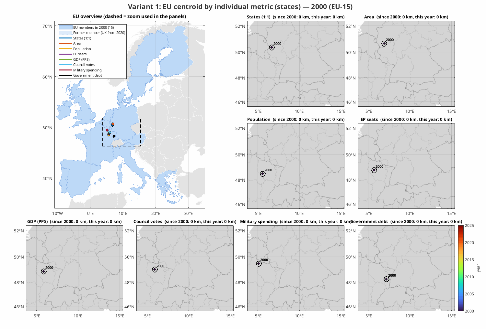
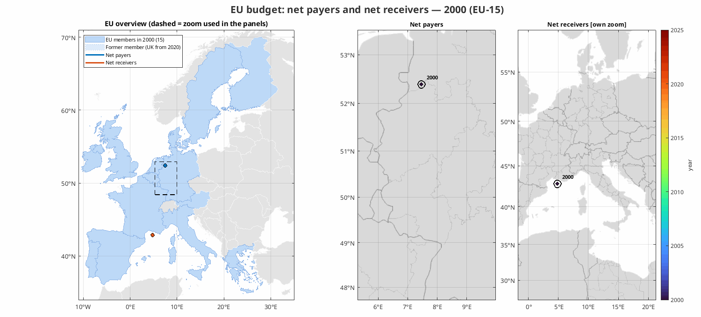

# Why the EU's centre moved: an economic reading of the two animations

This note interprets the two animations of the project:

| Animation | What it shows |
|---|---|
| [`results/animation_1_metrics.gif`](../results/animation_1_metrics.gif) | the EU centroid weighted by eight metrics: states (1:1), area, population, EP seats, GDP in PPS, Council votes, military spending and government debt |
| [`results/budget_animation.gif`](../results/budget_animation.gif) | the centroids of the **net payers** and **net receivers** of the EU budget |

For each movement it asks three questions: **why** the centroid moved, **what changed**
underneath, and **what follows from it** economically. All figures come from the data in
this repository (Eurostat, European Commission, SIPRI/World Bank, IMF); the method is
described in the [README](../README.md#methodology). Distances are great-circle
distances between centroids, years refer to membership on 31 December.

## Key takeaways

1. **Three shocks moved the EU more than 25 years of economics.** The 2004 enlargement,
   the 2007 enlargement and Brexit (2020) account for most of every shift. In normal years
   the population centroid moves 1–4 km.
2. **Political weight has moved east much faster than economic weight.** The gap between
   the "one state, one vote" centroid and the GDP (PPS) centroid grew from **177 km
   (2000) to 390 km (2025)**. The EU's decision-making centre now sits in southern
   Bohemia, its economic centre in Baden-Württemberg.
3. **Convergence is real but slow, and emigration works against it.** The 13 members that
   joined since 2004 raised their share of EU GDP (PPS) from 8.8 % (2004) to 17.9 %
   (2024), but several of them lost 10–16 % of their population since 2007.
4. **Money flows over a shorter distance than it used to.** The net-receiver centroid
   moved **1,249 km**, from the Gulf of Lion to Hungary. The payer–receiver distance fell
   from 1,215 km (2003) to 573 km (2010): EU transfers now go mostly from Germany to its
   immediate eastern neighbours, which are also its supply-chain partners.
5. **Security and fiscal risk have their own geography.** Military spending jumped
   north-east after 2022 (Poland ×2.5 in three years), while public debt stays anchored
   in the south-west and moved east least of all metrics (129 km).

## 1. The three shocks

Jump of each centroid in the year of the event (km):

| Metric | 2004 enlargement | 2007 enlargement | 2013 (Croatia) | 2014 (Lisbon voting) | 2020 (Brexit) | Total 2000–2025 |
|---|---|---|---|---|---|---|
| States (1:1) | **419** | 85 | 19 | 0 | 46 | 553 |
| Council votes | 247 | 91 | 11 | **156** | 141 | 294 |
| EP seats | 237 | 89 | 9 | 8 | 101 | 396 |
| Area | 174 | 110 | 9 | 0 | 60 | 333 |
| Population | 164 | 79 | 4 | 2 | 141 | 303 |
| GDP (PPS) | 85 | 39 | 2 | 4 | **132** | 234 |
| Military spending | 40 | 19 | 12 | 15 | **219** | 352 (to 2024) |
| Government debt | 26 | 1 | 12 | 12 | **164** | 129 |

**Why.** Enlargement adds countries that are numerous, fairly populous and relatively
poor. Metrics that count states or people jump far (states 419 km, EP seats 237 km), while
metrics that count money barely move (GDP 85 km, military 40 km, debt 26 km): in 2004 the
ten newcomers brought 16 % of the population but under 9 % of GDP in PPS, and little
public debt. Brexit is the mirror image. The UK was rich, indebted and heavily armed, so money
metrics jump the most (military 219 km, debt 164 km, GDP 132 km), while the count of
states moves only 46 km.

**Consequence.** Enlargement is primarily a *political* and *demographic* event and only
later an economic one. The institutions shift east at once; the economy follows over
decades. Brexit removed a large net payer, the largest military budget and 16 % of EU
public debt in one step, and pushed every centroid south-east.

## 2. Political weight vs. economic weight

**What changed.** Three of the eight metrics measure institutional weight: states 1:1,
EP seats and Council votes. All three are designed to over-represent small members
(equal votes per state, degressive proportionality of EP seats, the 55 % of states
condition in the Council). Most new members are small or medium-sized and lie to the
east, so these centroids moved 300–550 km east, while the GDP centroid moved 234 km.

The **2014 switch to Lisbon double-majority voting** shows how much the rules matter: the
Council-votes centroid moved **156 km west** in a single year with no change in
membership. The Nice weights had over-represented medium-sized states such as Poland and
Spain; the population-based weights shifted that weight back to Germany and France.

**Consequence.** The distance between the political and the economic centre more than
doubled (177 → 390 km). The countries whose vote counts most in unanimity and in the
"55 % of states" test are, on average, not the countries that generate most of the
output or pay most into the budget. This is the structural background of recurring
conflicts over budget conditionality, rule-of-law mechanisms and the size of cohesion
spending: the coalition that decides and the coalition that pays overlap less than in
2000.

## 3. Population: the westward creep between enlargements

**What changed.** Between enlargements the population centroid moves *west*, about
1–3 km a year: from 8.61° E to 8.35° E in 2007–2019 and from 9.75° E to 9.58° E in
2020–2025. Population change 2007–2025:

| Shrinking | | Growing | |
|---|---|---|---|
| Latvia | −15.8 % | Ireland | +25.3 % |
| Bulgaria | −15.0 % | Spain | +9.7 % |
| Lithuania | −11.1 % | France | +8.2 % |
| Croatia | −10.2 % | Germany | +1.5 % |
| Romania | −9.9 % | Italy | +0.7 % |
| Hungary | −5.2 % | | |
| Poland | −4.3 % | | |

**Why.** Free movement of labour combined with large wage gaps produced sustained
emigration from the east and south-east, on top of low fertility. Western members grew
through immigration from both inside and outside the EU.

**Consequence.** For the sending countries emigration brings remittances and eases
unemployment in the short run, but it shrinks the labour force, raises dependency ratios
and puts pressure on pension systems and public services. Labour shortages have in turn
pushed up wages in Central Europe, which supports convergence but erodes the low-cost
advantage that attracted foreign investment. For the receiving countries it added labour
supply. Demographically, the EU is slowly re-centring to the west even as its
institutions sit further east.

## 4. GDP: convergence in purchasing power

**What changed.** Between enlargements the GDP (PPS) centroid moves *east*, the opposite
of population. The share of the 13 post-2004 members in EU GDP:

| | 2004 | 2007 | 2013 | 2019 | 2024 |
|---|---|---|---|---|---|
| GDP in PPS | 8.8 % | 11.6 % | 13.5 % | 14.8 % | 17.9 % |
| GDP in EUR | 4.6 % | 6.9 % | – | 9.3 % | 12.9 % |

**Why.** Integration into the single market, foreign direct investment (largely into
manufacturing tied to German and other western supply chains), EU cohesion funding and
rising productivity let the new members grow faster than the old ones. The gap between
the PPS and the EUR share shows their lower price levels: in real purchasing power they
are much larger than in market prices.

**Consequence.** Convergence is the main economic success of enlargement, but at this
pace it takes decades: in 2024 the new members still had 22 % of the EU population and
18 % of its output in PPS. As they get richer they gradually lose eligibility for the
highest cohesion support, which is already visible in the budget (section 7).

## 5. Military spending: Brexit, then a turn to the north-east

**What changed.** The military-spending centroid starts as the westernmost of all
metrics (UK and France). The UK alone made up 20.7 % of EU military spending in 2019, so
Brexit moved the centroid **219 km** south-east, the largest single jump in the project.
After Russia's full-scale invasion of Ukraine it turned **north-east**, 123 km in
2021–2024:

| | 2021 | 2022 | 2023 | 2024 |
|---|---|---|---|---|
| Poland + Baltic states, share of EU military spending | 6.9 % | 7.2 % | 10.1 % | 11.8 % |
| Poland, USD billion | 15.3 | 15.3 | 26.3 | 38.0 |
| Germany, share | 21.5 % | 21.7 % | 22.0 % | 24.0 % |

**Why.** Threat perception follows geography. The front-line states closest to Russia
and Belarus raised spending fastest (Poland ×2.5 between 2021 and 2024); Germany's
post-2022 increase pulled the centroid further into Central Europe.

**Consequence.** Defence demand (procurement, ammunition, infrastructure) is shifting
towards Central and Eastern Europe, which matters for where defence-industrial capacity
and investment will be built. It also adds fiscal pressure in countries with limited
fiscal room, which is the background of the debate on EU-level defence financing (such
as the 2025 SAFE loan instrument). After Brexit the EU lost its largest military spender,
and its security centre of gravity now lies in Germany rather than on the Atlantic.

## 6. Government debt: the anchor in the south-west

**What changed.** The debt centroid moved only 129 km in 25 years, by far the least of
any metric, and mostly **south**, not east. Shares of EU general government debt:

| | 2000 | 2008 | 2019 | 2025 |
|---|---|---|---|---|
| Italy | 23.5 % | 21.1 % | 18.1 % | 19.9 % |
| France | 15.3 % | 16.8 % | 17.9 % | 22.2 % |
| Germany | 21.9 % | 20.5 % | 15.6 % | 18.2 % |
| Spain | 6.5 % | 5.3 % | 9.2 % | 10.9 % |
| United Kingdom | 11.8 % | 12.3 % | 16.2 % | – |
| 13 post-2004 members | – | 4.0 % | 5.1 % | 9.1 % |

**Why.** The new members joined with little public debt, so enlargement hardly moved the
centroid (26 km in 2004). Between 2008 and 2019 it drifted about 105 km **west**: the
financial and euro-area crises raised debt sharply in Spain, the UK and France, while
Germany cut its share from 20.5 % to 15.6 % under its debt brake and budget surpluses.
Brexit removed the UK and moved the centroid 164 km south. The pandemic then raised debt
everywhere, most in France.

**Consequence.** Fiscal risk in the EU is concentrated in a few large western and
southern economies, and the gap between the population centroid and the debt centroid
widened from 122 km to 152 km. The countries whose growth and population are moving the
EU east are not the ones carrying its public debt. This is why EU fiscal rules, the
ECB's crisis instruments and common borrowing (NextGenerationEU) matter most for a
handful of large members, and why the debt question remains a west-and-south issue even
in an EU whose institutions sit further east.

## 7. The EU budget: who pays and who receives

The budget animation shows two centroids: of **net payers** (weighted by what they pay
in net terms) and of **net receivers** (weighted by what they receive). The measure is
the Commission's operating budgetary balance, excluding administration, customs duties
and NextGenerationEU.

### What changed

**The receivers moved 1,249 km**, the largest shift in the whole project: from the Gulf
of Lion in 2000 (Spain, Greece, Portugal, Ireland), through northern Italy (2006–2007)
and the northern Adriatic / Austria (2008–2013), to **Hungary** (from 2014: Poland, Hungary, Romania, Czechia).
**The payers stayed in western Germany** and moved only 277 km south.

Composition of net balances (share of the total net transfer):

| Year | Largest net receivers | Largest net payers |
|---|---|---|
| 2000 | Spain 33 %, Greece 27 %, Portugal 13 %, Ireland 11 % | Germany 53 %, UK 19 %, Netherlands 10 % |
| 2010 | Poland 27 %, Spain 13 %, Greece 12 %, Hungary 9 % | Germany 30 %, UK 18 %, France 18 %, Italy 15 % |
| 2019 | Poland 30 %, Hungary 13 %, Greece 9 %, Czechia 9 % | Germany 36 %, UK 17 %, France 17 %, Italy 10 % |
| 2025 | Poland 21 %, Romania 19 %, Greece 12 %, Czechia 8 % | Germany 47 %, France 17 %, Italy 10 %, Netherlands 10 % |

**Graduation from receiver to payer** is visible in the data: Italy, Denmark and Finland
have been net payers since 2001, Ireland consistently since 2017 (a receiver in every
earlier year except 2009), and Spain appears as a net payer for the first time in 2025.
Portugal, Greece and every post-2004 member except Cyprus (a small net payer in 2007–2009,
2012 and 2015) remained net receivers throughout.

### Why

Cohesion policy directs money to regions below 75 % of the EU average GDP per head. In
2000 these were mostly in the Iberian peninsula, Greece and Ireland. After 2004 almost
all of Central and Eastern Europe qualified, while the old cohesion countries grew
richer (Ireland most of all). The receiving end of the budget therefore moved east with
the poverty map, while the paying end, set by GNI, stayed where income is highest.

### Distance and volume

| | 2000 | 2003 | 2010 | 2015 | 2020 | 2024 | 2025 |
|---|---|---|---|---|---|---|---|
| Payer–receiver distance (km) | 1,075 | **1,215** | **573** | 922 | 659 | 693 | 834 |
| Volume of net transfers (EUR bn) | 15.2 | 17.1 | 31.1 | 43.5 | **47.9** | 24.3 | 31.3 |

- **The axis got shorter.** In 2000–2003 money flowed from Germany to the Iberian
  peninsula and Greece, over 1,000–1,200 km. After enlargement it flows mostly from
  Germany to Poland, Czechia and Hungary, over roughly 600–900 km. Much of the cohesion
  money is spent on investment goods and construction, and the receivers are closely
  integrated into German and other western supply chains, so part of the transfer
  returns to the payers as demand for their exports.
- **The volume tripled** from EUR 15 bn to EUR 48 bn (2020), mainly because more and
  poorer regions became eligible.
- **The volume follows the budget cycle.** Payments are low at the start of each
  seven-year programming period, when projects are only being launched (2016–2017 and
  2024), and peak towards its end (2013–2015 and 2020–2023), when they are being paid out.
  The dip in 2024 to EUR 24 bn is this cycle, not a policy change.

### What it means for payers and receivers

The budget is small for payers and large for receivers. In 2023 Germany's net balance was
−0.41 % of its GNI, the Netherlands' −0.33 %, France's −0.31 %. In 2019 Hungary received
+3.7 % of its GNI, Lithuania +2.5 %, Poland +2.4 %, Czechia +1.7 %. For the receivers,
EU funds are a major source of public investment, and their timing moves domestic
investment and growth from year to year.

**Brexit concentrated the burden.** The UK paid 17–19 % of all net contributions. After it
left, Germany's share of net payments rose from 32–36 % to 43–54 % (2023–2024). The
burden now rests on fewer, mostly continental, payers, which feeds the debate on new own
resources and on budget corrections for large contributors.

**NextGenerationEU is not in these numbers.** The 2021–2026 recovery fund is financed by
common borrowing, not by national contributions, and its grants go to a large extent to
Italy and Spain. Including it would temporarily pull the receivers' centroid back south-
west. Its repayment from 2028 onwards will be a new, shared liability of the payers.

## 8. Synthesis

| Dimension | Centroid in 2025 | Moved since 2000 | Direction |
|---|---|---|---|
| Institutions (states 1:1) | southern Bohemia | 553 km | east |
| People (population) | near Lake Constance | 303 km | east, creeping back west |
| Output (GDP PPS) | Baden-Württemberg | 234 km | east, slowly |
| Security (military spending) | north-eastern Baden-Württemberg | 352 km | east, north-east since 2022 |
| Fiscal risk (public debt) | Swiss Plateau | 129 km | south |
| EU budget, receivers | Hungary | 1,249 km | east |
| EU budget, payers | Mainz (Rhineland-Palatinate) | 277 km | south |

The EU of 2025 has several centres rather than one. Decision-making weight sits furthest
east, money and debt furthest west, security is moving north-east, and the budget links
a payer core on the Rhine with a receiver core on the Danube. Each further enlargement,
for example to Ukraine, Moldova or the Western Balkans, would pull the institutional and
receiver centroids further east and enlarge the transfer volume, while the GDP and debt
centroids would hardly move: the same asymmetry as in 2004, at a larger scale.

## Caveats

- Countries are single points in variant 1; the NUTS-3 variant shows this changes the
  result by only 7–25 km at EU level.
- The operating budgetary balance is an accounting measure. It ignores indirect benefits
  of the single market and the returns to payers through trade, and it depends on when
  payments are made, not when funds were allocated. Belgium appears as a small net
  receiver from 2022, most likely because much EU programme spending is booked to
  beneficiaries registered in Brussels.
- Military spending follows the SIPRI definition in current USD; 2025 data are not yet
  available. UK debt for 2000–2019 combines the IMF debt ratio with Eurostat GDP.
- The causes described here (emigration, FDI, crisis debt, cohesion eligibility, threat
  perception) are well-documented drivers that are consistent with the data, but the
  centroids themselves only measure *where* the weight moved, not *why*.

Data sources and licences are listed in the [README](../README.md#data-sources-and-licences).
